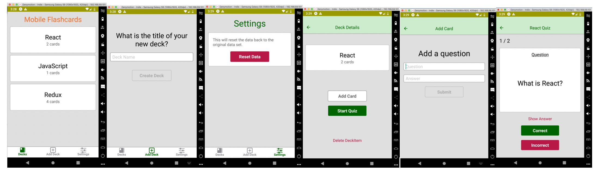

# Mobile Flashcards
This is a third project of Udacity React Developer Nanodegree.
Mobile Flashcards is a React Native app for iOS and Android that allows users to create decks, add cards with questions  and quiz themselves and get score up to quiz completion.



* It uses React Native, Expo, Redux, & React Navigation,AsyncStore.

* The `_DATA.js` file represents a fake database and methods that let you access the data.

## Installation / Prerequisites

Clone the repository, change directories, and use npm or yarn to install the dependencies.

```bash
* To get started developing right away:

$ Fork or clone repository from `https://github.com/bguneser/react_redux_would_you_rather_project.git`
$ cd mobile-flashcards
$ install all project dependencies with `yarn install`
$ yarn start
```

## What You're Getting
```bash
├── README.md - This file.
├── package.json # npm package manager file. It's unlikely that you'll need to modify this.
├── components # React Components
    └── AddDeck.js # It is inside MaintabNavigator and has feature to add new deck to deck list with deck name
    └── AddQuizCard.js # allows user to add question and answer for choosen deck
    └── Card.js # Card label feature
    └── CustomQuiz.js # According to platform render AndroidQuiz or IOSQuiz
    └── DeckDetail.js # Includes detail of choosen deck with title and number of card feature as well as Add Card and Start Quiz
    └── Decks.js # Deck List on main screen
    └── FlashCardSettings.js # Has feature to reset data
    └── IOSQuiz.js # IOS quiz screen driven from platform with number of question and Correct/Incorrect button
    └── AndroidQuiz.js # Android quiz screen driven from platform with number of question and Correct/Incorrect button
    └── PollTeaser.js # shows poll preview 
    └── UserCard.js # displaying each of the following child components based on the context
├── navigation # Navigation Feature
    └── AppNavigationContainer.js # Container for navigation
    └── MainTabNavigator.js #Includes route config with Decks - AddDeck - FlashCardSettings 
├── reducers # React Components
    └── index.js # reducer for receiveDeck - addDeck and removeDeck
├── utils # React Components 
    └── _DATA.js # includes fake database let you access the data
    └── colors.js # includes colors feature
    └── api.js # includes api call methods 
    └── helpers.js # notification features
├── App.js # Intro to application
    

## Usage

The project can be run with 

- `yarn start`

This will open Expo Developer Tools in the browser.  You can then do one of the following.

- Use your device to test:

    Scan the QR Code using the Expo Client app ([Expo Client for Android & iOS](https://expo.io/tools#client))  from an Android or iOS device.
- Use an Android Emulator or iOS Simulator to run the app:
    - [iOS Simulator Setup](https://docs.expo.io/versions/v33.0.0/introduction/installation/#ios-simulator)
    - [Android Emulator Setup](https://docs.expo.io/versions/v33.0.0/introduction/installation/#android-emulator)


## Main Features

# Decks
-  List of created decks which includes the name of each deck and the number of cards. 
# DeckItem
-  Includes deck title and number of questios
# Deck Detail
- Includes `DeckItem` and `AddCard` for new question, `Start Quiz` for kick off quiz and `Delete Deck Item` to delete deck from decklist
# AndroidQuiz / IOSQuiz
- Those screen arranged according to platform and inclues question and text button to show answer and option for Correct and Incorrect intention for user.
Correct and Incorrect buttons take user to another question or score if no question remianed
# MainTabNavigator
- There are three navigation option Decks show deck list, Add Deck has functionality to add deck lastly settings to reset data to original content

Code talks to the database via methods:

*  getData
*  fetchDecks
*  getDeckById
*  removeDeckItem
*  saveDeckTitle
*  addQuizCardToDeck
*  resetDecks

## Testing

This project has been tested on the following platforms:

- Android Geny Motion Samsung Galaxy S9
- iOS 8 Plus

